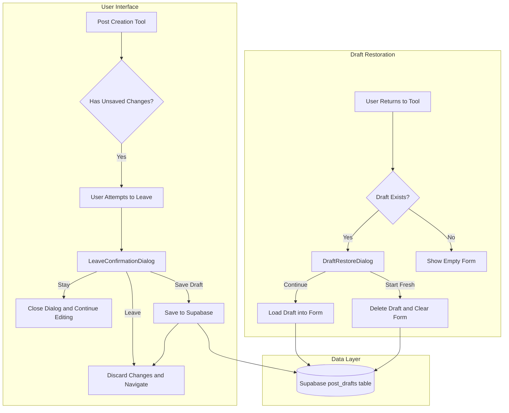

# Post Draft System Architecture

## Overview

This document outlines the architecture for implementing a draft system that prevents data loss when users navigate away from post creation tools. The system will:

1. Detect when a user has unsaved changes and attempts to leave
2. Show a confirmation dialog with options to leave, stay, or save as draft
3. Store drafts in Supabase linked to the user's account
4. Restore drafts when users return to the tool

## Affected Tools

Based on codebase analysis, the following tools have post creation functionality:

| Tool | Path | Type |
|------|------|------|
| Social Automation App | `src/components/apps/SocialAutomationApp.tsx` | Social media posts |
| Social Create Post | `src/components/social/CreatePostContent.tsx` | Social media posts |
| WordPress Create Post | `src/components/apps/wordpress/CreatePostContent.tsx` | WordPress blog posts |
| AI Agent Editor | `src/components/apps/ai-agent/EditorAIContent.tsx` | WordPress post editing |

## System Architecture



## Database Schema

### Table: `post_drafts`

```sql
CREATE TABLE post_drafts (
    id UUID PRIMARY KEY DEFAULT gen_random_uuid(),
    user_id TEXT NOT NULL,  -- Clerk user ID
    tool_type TEXT NOT NULL,  -- social-automation, wordpress-create, ai-editor
    draft_data JSONB NOT NULL,  -- Flexible storage for all form fields
    created_at TIMESTAMPTZ DEFAULT NOW(),
    updated_at TIMESTAMPTZ DEFAULT NOW(),
    
    -- One draft per user per tool
    UNIQUE(user_id, tool_type)
);

-- Enable RLS
ALTER TABLE post_drafts ENABLE ROW LEVEL SECURITY;

-- Policy: Users can only access their own drafts
CREATE POLICY "Users can manage own drafts" ON post_drafts
    FOR ALL USING (user_id = auth.uid()::text);
```

## Component Structure

### 1. usePostDraft Hook

```typescript
// src/hooks/usePostDraft.ts
interface UsePostDraftOptions {
    toolType: string;  // Unique identifier for the tool
    getDraftData: () => Record<string, any>;  // Function to get current form data
    setDraftData: (data: Record<string, any>) => void;  // Function to restore form data
    hasChanges: () => boolean;  // Function to check if form has changes
}

interface UsePostDraftReturn {
    saveDraft: () => Promise<void>;
    loadDraft: () => Promise<Record<string, any> | null>;
    deleteDraft: () => Promise<void>;
    hasDraft: () => Promise<boolean>;
    draftExists: boolean;
    isLoaded: boolean;
}
```

### 2. useUnsavedChangesWarning Hook

```typescript
// src/hooks/useUnsavedChangesWarning.ts
interface UseUnsavedChangesWarningOptions {
    hasUnsavedChanges: boolean;
    onLeave: () => void;  // Called when user confirms leave
    onSaveDraft: () => Promise<void>;  // Called when user saves draft
}
```

### 3. LeaveConfirmationDialog Component

```typescript
// src/components/drafts/LeaveConfirmationDialog.tsx
interface LeaveConfirmationDialogProps {
    open: boolean;
    onOpenChange: (open: boolean) => void;
    onLeave: () => void;
    onSaveDraft: () => Promise<void>;
    isSaving: boolean;
}
```

### 4. DraftRestoreDialog Component

```typescript
// src/components/drafts/DraftRestoreDialog.tsx
interface DraftRestoreDialogProps {
    open: boolean;
    onOpenChange: (open: boolean) => void;
    onContinue: () => void;
    onStartFresh: () => void;
    draftTimestamp?: Date;
}
```

## Implementation Flow

### Phase 1: Core Infrastructure

1. Create database migration for `post_drafts` table
2. Create `usePostDraft` hook for draft CRUD operations
3. Create `useUnsavedChangesWarning` hook for navigation protection

### Phase 2: UI Components

4. Create `LeaveConfirmationDialog` component using existing AlertDialog
5. Create `DraftRestoreDialog` component using existing Dialog

### Phase 3: Integration

6. Integrate into SocialAutomationApp
7. Integrate into WordPress CreatePostContent
8. Integrate into AI Agent EditorAIContent

## Tool-Specific Draft Data

### SocialAutomationApp Draft Data

```typescript
interface SocialAutomationDraft {
    caption: string;
    selectedPlatforms: string[];
    aiEnhance: boolean;
    postMode: string;
    scheduledTime: string;
    imagePreviews: string[];  // Base64 for storage
    videoPreviews: string[];  // Base64 for storage
    tone: string;
    customTone: string;
    // Account selections
    selectedFacebookPageIds: string[];
    selectedInstagramPageIds: string[];
    selectedTikTokAccountIds: string[];
    selectedYouTubeChannelIds: string[];
}
```

### WordPress CreatePostContent Draft Data

```typescript
interface WordPressDraft {
    selectedSiteIds: string[];
    topic: string;
    sections: number;
    keywords: string;
    location: string;
    occupation: string;
    audience: string;
    tone: string;
    customTone: string;
    imagePreview: string | null;  // Base64
}
```

### AI Agent EditorAIContent Draft Data

```typescript
interface AIAgentEditorDraft {
    selectedSiteId: string;
    selectedPostId: number | null;
    userInstruction: string;
    imagePreviews: string[];  // Base64
}
```

## Browser Navigation Protection

The system will protect against:

1. **Internal navigation** - React Router navigation via custom dialog
2. **Browser back/forward** - `beforeunload` event with browser's native dialog
3. **Page refresh** - `beforeunload` event with browser's native dialog
4. **Tab close** - `beforeunload` event with browser's native dialog

Note: Modern browsers limit custom dialogs for `beforeunload`, so we use the native browser dialog for those cases while providing our custom dialog for internal React Router navigation.

## User Experience Flow

### Scenario 1: User Leaves Without Saving

1. User fills out post form
2. User clicks browser back button or navigates to another page
3. Custom dialog appears: "Are you sure you want to leave? All details will be lost."
4. Options:
   - **Leave** - Discard changes and navigate away
   - **Stay** - Close dialog and continue editing
   - **Save as Draft** - Save to database, then navigate away

### Scenario 2: User Returns After Saving Draft

1. User navigates back to the tool
2. System checks for existing draft
3. If draft exists, dialog appears: "You have a saved draft. Continue where you left off?"
4. Options:
   - **Continue** - Load draft data into form
   - **Start Fresh** - Delete draft and show empty form

### Scenario 3: Draft Overwrite

1. User has existing draft
2. User makes new changes and saves as draft again
3. Old draft is overwritten (one draft per tool per user)

## Technical Considerations

### Image/Video Storage

For media files, we have two options:

**Option A: Base64 in JSONB**
- Pros: Simple, no additional storage needed
- Cons: Large payload, 1MB Supabase row limit may be exceeded

**Option B: Supabase Storage**
- Pros: No size limit, better for large files
- Cons: More complex, requires storage bucket setup

**Recommendation:** Use Base64 for small images, warn users about large files. For video files, do not include in draft - only store the fact that videos were attached and warn user.

### Error Handling

- Network errors during save: Show error toast, prevent navigation
- Network errors during load: Show error toast, allow fresh start
- Quota exceeded: Warn user about large media files

### Performance

- Debounce draft auto-save (optional feature for future)
- Lazy load draft check on component mount
- Cache draft state in memory to avoid repeated DB calls

## File Structure

```
src/
├── hooks/
│   ├── usePostDraft.ts
│   └── useUnsavedChangesWarning.ts
├── components/
│   └── drafts/
│       ├── LeaveConfirmationDialog.tsx
│       └── DraftRestoreDialog.tsx
├── lib/
│   └── draft-utils.ts
└── types/
    └── draft.ts

database/
└── migrations/
    └── create_post_drafts_table.sql
```

## Dependencies

Existing dependencies that will be used:
- `@supabase/supabase-js` - Database operations
- `@clerk/clerk-react` - User authentication
- `sonner` - Toast notifications
- `framer-motion` - Dialog animations
- `@/components/ui/alert-dialog` - Dialog component
- `@/components/ui/dialog` - Dialog component
